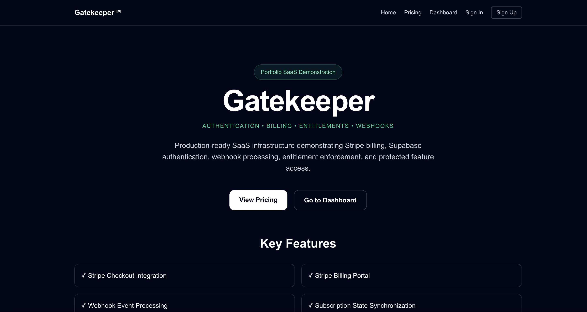
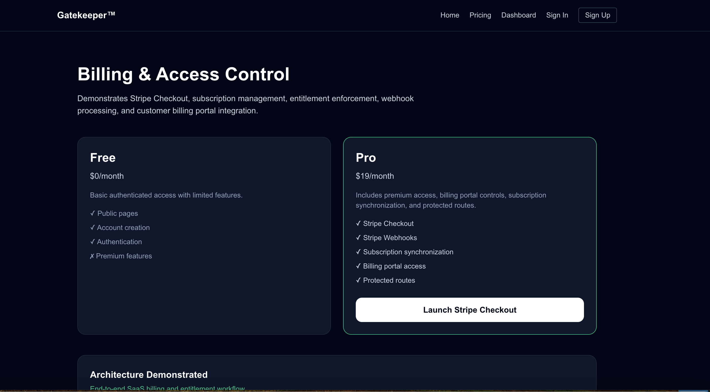
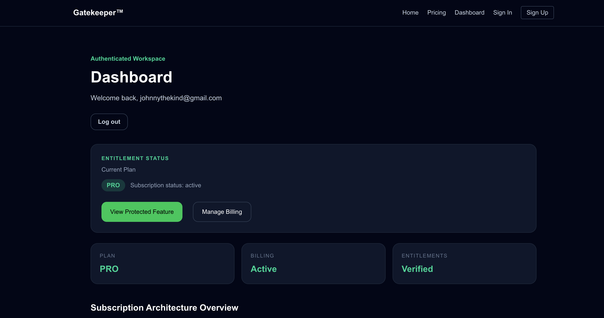
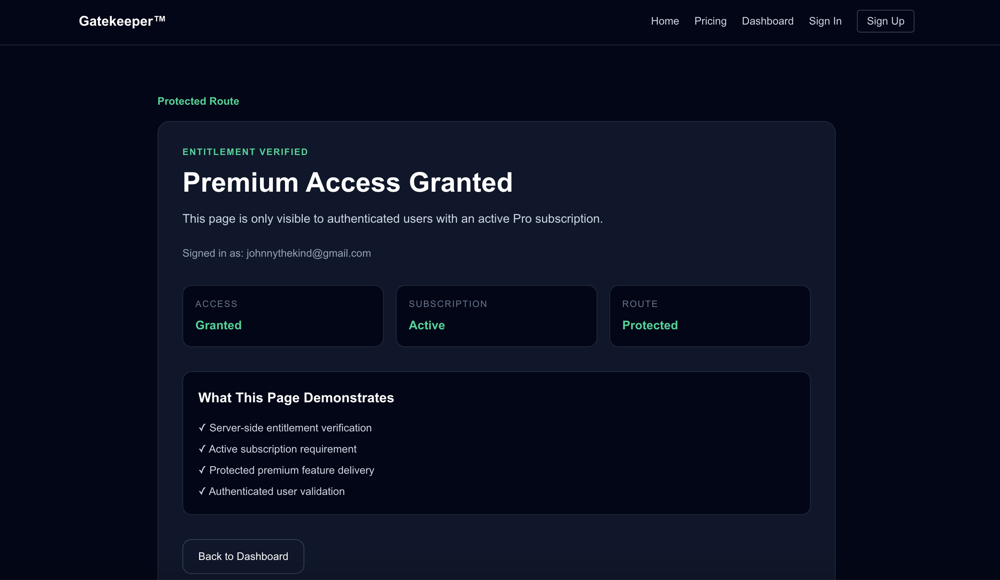

# Gatekeeper™

### Authentication • Billing • Entitlements • Webhooks

Gatekeeper is a production-ready SaaS infrastructure demonstration built with Next.js, TypeScript, Supabase, PostgreSQL, Stripe, and Vercel.

The project showcases the complete subscription lifecycle used by modern SaaS applications, including authentication, subscription billing, webhook processing, entitlement enforcement, protected routes, and customer billing management.

---

## Project Overview

Gatekeeper demonstrates how a real SaaS application controls access to premium functionality through authentication and subscription verification.

The platform allows users to:

* Create accounts
* Authenticate securely
* Purchase subscriptions through Stripe Checkout
* Manage billing through the Stripe Billing Portal
* Synchronize subscription state through webhooks
* Access protected premium features
* Enforce server-side entitlements

---

## Screenshots

### Home Page

Marketing landing page introducing the application and demonstrated architecture.

### Pricing Page

Subscription plans with Stripe Checkout integration.

### Dashboard

Authenticated workspace displaying subscription status, billing controls, and entitlement information.

### Protected Feature

Server-side protected route demonstrating entitlement enforcement and premium feature access.

---

## Features Demonstrated

### Authentication

* User registration
* User login
* User logout
* Protected dashboard access

### Subscription Billing

* Stripe Checkout integration
* Subscription creation
* Subscription lifecycle management
* Billing Portal integration

### Webhook Processing

* Checkout completion handling
* Subscription updates
* Subscription cancellations
* Database synchronization

### Entitlements

* Server-side access verification
* Protected route enforcement
* Active subscription validation
* Premium feature gating

### Production Deployment

* Vercel deployment
* Environment variable management
* Supabase integration
* Stripe production workflow

---

## Architecture Flow

Visitor

↓

Create Account

↓

Authenticate

↓

Access Dashboard

↓

Purchase Subscription

↓

Stripe Checkout

↓

Webhook Processing

↓

Subscription Synchronization

↓

Entitlement Verification

↓

Protected Feature Access

↓

Billing Portal Management

---

## Technology Stack

### Frontend

* Next.js
* TypeScript
* Tailwind CSS

### Authentication

* Supabase Auth

### Database

* PostgreSQL
* Supabase

### Billing

* Stripe Checkout
* Stripe Billing Portal
* Stripe Webhooks

### Hosting

* Vercel

---

## Portfolio Value

Gatekeeper demonstrates the foundational infrastructure required by modern SaaS applications.

Concepts demonstrated include:

* Authentication
* Authorization
* Subscription Billing
* Entitlements
* Protected Routes
* Webhook Processing
* Customer Self-Service Billing
* Environment Management
* Production Deployment

This project serves as a reusable foundation for future platform applications and portfolio projects.

---

## Future Applications

The architecture and patterns demonstrated in Gatekeeper will be reused across future projects including:

* VaultDesk
* AppStack
* InvestorOS
* Acquisition IQ
* DealFlow AI
* SellerMind

---

## Author

Johnny Groves

Portfolio SaaS Demonstration Project
